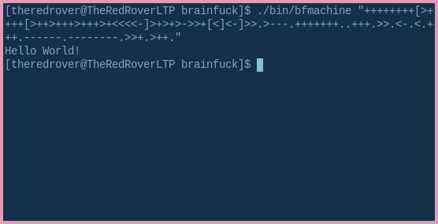
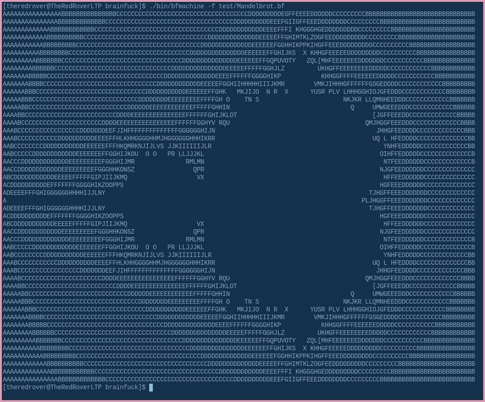

# Simple brainfuck compiler

This brainfuck compiler don't support input operator `,` and has restriction in 30000 memory cells (as classic brainfuck).

### Instalation

To run on yout linux machin make 'git clone' of this rep and use command 'make' to compile compiler.

### Usage

To run compiler with string use comand ` ./bfmachine "your_code" `
To run compiler with file use flag `-f` like that `./bfmachine -f "way_to_your_file"`

### Usage example

`./bin/bfmachine "++++++++[>++++[>++>+++>+++>+<<<<-]>+>+>->>+[<]<-]>>.>---.+++ ++++..+++.>>.<-.<.+++.------.--------.>>+.>++."`

`[theredrover@TheRedRoverLTP brainfuck]$ ./bin/bfmachine -f test/Mandelbrot.bf`

